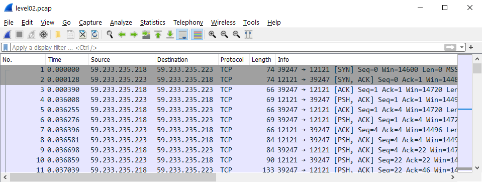
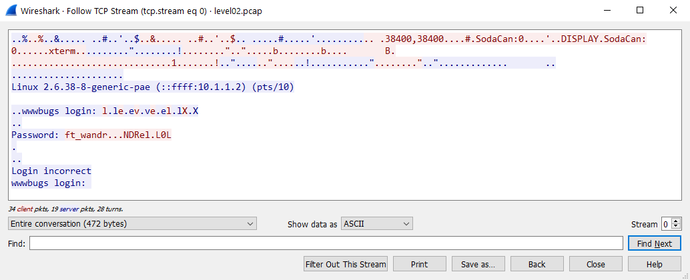
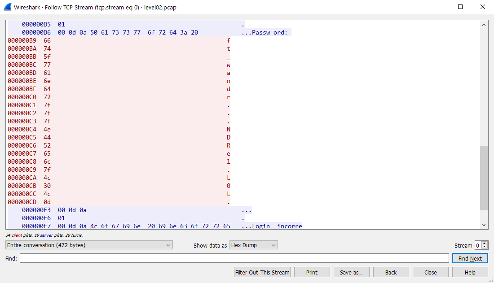

# Level 02

## Initial Context

- A single file: `level02.pcap`

## Solving the Challenge

[PCAP](https://tools.ietf.org/id/draft-gharris-opsawg-pcap-00.html) files store network packets.

We can use software like [Wireshark](https://www.wireshark.org/) to open them.

The file contains packets of someone trying to login to a server.

Since everything is displayed as packets, its hard to keep track of what has been sent or received. To make it easier, we can use `Analize > Follow > TCP Stream`.

We can see everything very well now! The password seems to be `ft_wandr...NDRel.L0L`, but it does not work for `flag02`.

Let's try by viewing the byte's values.

We can now see the problem: some are control characters.

| Hex | Character |
| --- | --- |
| 0d | carriage return |
| 7f | delete |

So the password would be: **ft_wa**~~ndr~~**NDRe**~~l~~**L0L** or `ft_waNDReL0L`.