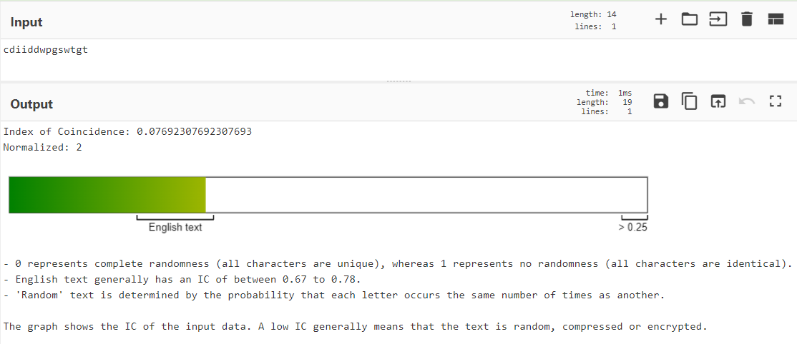
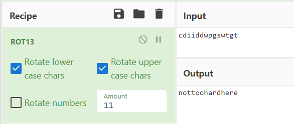

# Level 00

## Initial Context

- Empty home directory.
- Hint: find the first file that can only be run by user `flag00`.

## Solving the Challenge

### Finding the file

By doing a simple `find`, we can look for the file that are own by user `flag00`:

```bash
$ find / -user flag00 2>/dev/null
/usr/sbin/john
/rofs/usr/sbin/john
```

(`2>/dev/null` is used to remove the error messages)

### Decrypting

The file content is:

```bash
$ cat /usr/sbin/john
cdiiddwpgswtgt
```

This input does not seems to work as a password for `flag00`.

Using [CyberChef's Index of Coincidence](https://gchq.github.io/CyberChef/#recipe=Index_of_Coincidence()&input=Y2RpaWRkd3Bnc3d0Z3Q), we can determine that the input looks like english text. Maybe the characters are rotated?


Using [CyberChef's ROT13](https://gchq.github.io/CyberChef/#recipe=ROT13(true,true,false,11)&input=Y2RpaWRkd3Bnc3d0Z3Q), we can test all the possible number to try if they match. We have a match!
